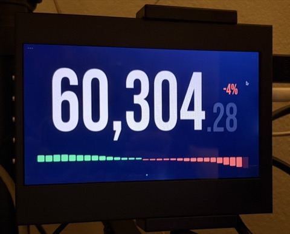
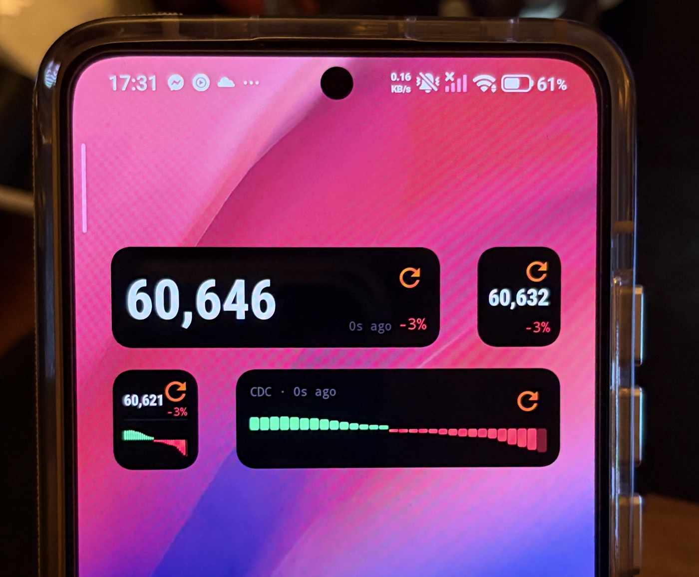

```
 ██████╗██████╗ ███╗   ██╗    ████████╗██╗ ██████╗██╗  ██╗███████╗██████╗
██╔════╝██╔══██╗████╗  ██║    ╚══██╔══╝██║██╔════╝██║ ██╔╝██╔════╝██╔══██╗
██║     ██████╔╝██╔██╗ ██║       ██║   ██║██║     █████╔╝ █████╗  ██████╔╝
██║     ██╔══██╗██║╚██╗██║       ██║   ██║██║     ██╔═██╗ ██╔══╝  ██╔══██╗
╚██████╗██║  ██║██║ ╚████║       ██║   ██║╚██████╗██║  ██╗███████╗██║  ██║
 ╚═════╝╚═╝  ╚═╝╚═╝  ╚═══╝       ╚═╝   ╚═╝ ╚═════╝╚═╝  ╚═╝╚══════╝╚═╝  ╚═╝
```

*Real-time BTC price ticker — static web app + Android APK, no server, no dependencies.*



*Works as a dedicated Bitcoin dashboard or always-on Bitcoin clock — mount any screen, open the browser, done.*

---

## Live

[**crnds.github.io/btcticker**](https://crnds.github.io/btcticker) — open in any browser, no install required.

---

## Android

[**Download APK (v1.8.0)**](https://github.com/crnds/btcticker/releases/tag/v1.8.0) — sideload on any Android device (API 24+).

Enable **Install unknown apps** in Android Settings, then open the APK to install.



*Four widgets on a single home screen: the wide BTC Large (top-left) shows the full price with last-fetch time and % change; the compact BTC Small (top-right) gives a square glanceable price; the Combined Small (bottom-left) combines price and a mini CDC strip in one cell; and the CDC Large (bottom-right) shows the full 30-day EMA crossover chart. All update independently and share a background cache.*

---

## How It Works

```
Exchange WebSocket ──► app.js (browser) ──► requestAnimationFrame ──► DOM
 live trade stream       parses price +        batches writes at
 ~100ms updates          24hr % change         2/s max
```

The browser connects directly to the selected exchange's public WebSocket stream. Price snapshots are saved to `localStorage` every minute and pruned to a rolling 24 hr window — the last known price renders instantly on load before the socket connects.

The CDC Action Zone strip reads 30 days of daily OHLC data and renders a colour-coded EMA(12)/EMA(26) crossover bar chart at the bottom of the screen.

---

## Exchanges

Switch via the `···` menu. Selection is persisted to `localStorage`.

| Exchange | Feed | Pair |
|---|---|---|
| Binance | WebSocket | BTC/USDT |
| Bitstamp | WebSocket + REST | BTC/USD |
| Coinbase | WebSocket | BTC/USD |
| Kraken | WebSocket v2 | BTC/USD |
| OKX | WebSocket | BTC/USDT |

---

## Display

```
┌─────────────────────────────────┐
│ ···                          ⛶  │
│                                 │
│      104,888  +6%               │
│              .50                │
│                                 │
│  ▄▄ ▂▂ ██ ▃▃ ▅▅ ██ ▄▄ ▂▂ ▇▇   │  ← CDC strip (30 days, green/red)
│  WS-Status: ● live  2s ago      │
└─────────────────────────────────┘
```

- Price scales with viewport (`min(30vw, 80vh)`) — fills any screen size
- 24 hr % change stacked above the decimal, green `+` / red `−`
- CDC Action Zone: 30-day EMA(12)/EMA(26) crossover bars — green = bull, red = bear
- Status bar: pulsing green dot when live, red when reconnecting
- Exponential backoff reconnect: 1s → 2s → 4s … capped at 16s
- `F` key or button toggles fullscreen

---

## Android Widgets

Seven home screen widgets across three sizes. All show a live preview thumbnail in the widget picker, have an orange refresh button, and automatically reschedule their alarms after device reboot.

| Widget | Size | Refresh | Data source |
|---|---|---|---|
| BTC Large | 2×1 | 10 min | Binance REST |
| CDC Large | 2×1 | Daily | Kraken OHLC |
| BTC Small | 1×1 | 10 min | Binance REST |
| CDC Small | 1×1 | Daily | Kraken OHLC |
| Combined Large | 2×1 | 10 min (CDC lazy) | Binance + Kraken |
| Combined Small | 1×1 | 10 min (CDC lazy) | Binance + Kraken |
| Fear & Greed | 2×1 | Daily | CoinMarketCap |

### BTC Large (2×1)

```
┌──────────────────────────────────┐
│ 104,888                        ↻ │
│  at 23:24 (5m ago)          +6% │
└──────────────────────────────────┘
```

Price autoscales to fill the full widget height. % change and last-fetch time (absolute 24hr clock + relative age) overlaid at bottom-right.

### CDC Large (2×1)

```
┌──────────────────────────────────┐
│ CDC · at 23:24 (3h ago)        ↻ │
│ ▄▄▂▂██▃▃▅▅██▄▄▂▂▇▇▄▄▂▂██       │
└──────────────────────────────────┘
```

30-day EMA(12)/EMA(26) crossover strip. Green bars = bull, red bars = bear, today's bar at 40% opacity. Refreshes once daily; falls back to cached data when offline.

### BTC Small (1×1)

```
┌──────────────┐
│           ↻  │
│  104,888     │
│         +6%  │
└──────────────┘
```

Compact single-cell price widget. Same autoscaled price, % change overlaid bottom-right.

### CDC Small (1×1)

```
┌──────────────┐
│ CDC       ↻  │
│ ▄▂█▃▅█▄▂▇▄  │
│ ▅█▄▂▄█▅▂██  │
└──────────────┘
```

CDC strip squeezed into a single cell — 30 bars with no gaps to fit the full history.

### Combined Large (2×1)

```
┌─────────────────┬───────────────────────┐
│                 │ CDC · at 23:24 (3h ago)│
│    104,888      │ ▄▂█▃▅█▄▂▇▄          ↻ │
│           +6%   │ ▅█▄▂▄█▅▂██            │
└─────────────────┴───────────────────────┘
```

Combined widget — price on the left half, CDC strip on the right half, 50/50 split. Price refreshes every 10 minutes; CDC re-fetches only when the cache is older than 12 hours.

### Combined Small (1×1)

```
┌──────────────┐
│  104,888  ↻  │
│         +6%  │
├──────────────┤
│ ▄▂█▃▅█▄▂▇▄  │
└──────────────┘
```

Compact single-cell combined widget — price with % change in the top half, CDC strip in the bottom half, 50/50 vertical split. Price refreshes every 10 minutes; CDC re-fetches only when the cache is older than 12 hours.

### Fear & Greed (2×1)

```
┌──────────────────────────────────┐
│ Fear & Greed                   ↻ │
│      ●                           │
│   ██ ██ ██ ██ ██                 │
│        15                        │
│    Extreme fear                  │
└──────────────────────────────────┘
```

Semicircular gauge with 5 colour-coded arc segments (red → orange → yellow → light green → green). A white dot marks the current value position on the arc. Fetches CoinMarketCap Fear & Greed Index once daily; falls back to cached value when offline.

| Range | Label | Colour |
|---|---|---|
| 0–24 | Extreme Fear | `#ff1744` red |
| 25–49 | Fear | `#ff6d00` orange |
| 50–74 | Greed | `#69f0ae` light green |
| 75–100 | Extreme Greed | `#00e676` bright green |

---

## CDC Data

Three-tier fallback so the strip always renders:

1. **`localStorage`** — cached for 1 hour after last fetch
2. **`data/cdc.js`** — bundled snapshot committed to the repo
3. **Kraken REST API** — live fetch (`/public/OHLC?pair=XBTUSD&interval=1440`)

To refresh the bundled snapshot manually:

```bash
python3 fetch_cdc.py
```

---

## Building the Android APK

Requires [Android Studio](https://developer.android.com/studio).

```bash
# 1. Sync web assets into the Android project
cp index.html style.css app.js db.html www/
cp -r assets data www/
npx cap sync android

# 2. Open in Android Studio
npx cap open android

# 3. Build → Build APK(s) → app-debug.apk
```

---

## File Structure

```
btcticker/
├── index.html              — ticker: price display + exchange menu + CDC strip
├── style.css               — layout, Bebas Neue font, dark theme
├── app.js                  — WebSocket client, localStorage history, CDC logic
├── db.html                 — dashboard: CDC stats + price history
├── fetch_cdc.py            — fetches daily OHLC from Kraken, writes data/cdc.js
├── data/
│   └── cdc.js              — bundled CDC data (fallback when API is unavailable)
├── assets/
│   └── bebas-neue-400.woff2 — self-hosted display font (13.7 KB)
├── android/                — Capacitor Android project (build APK in Android Studio)
│   └── app/src/main/java/com/btcticker/app/
│       ├── PriceWidgetProvider.java       — BTC Large widget (2×1)
│       ├── CdcWidgetProvider.java         — CDC Large widget (2×1)
│       ├── PriceWidgetSmallProvider.java  — BTC Small widget (1×1)
│       ├── CdcWidgetSmallProvider.java    — CDC Small widget (1×1)
│       ├── CombinedWidgetProvider.java    — Combined Large widget (2×1)
│       ├── MiniCombinedWidgetProvider.java — Combined Small widget (1×1)
│       ├── FearGreedWidgetProvider.java   — Fear & Greed widget (2×1)
│       └── BootReceiver.java              — reschedules alarms after reboot
├── capacitor.config.json   — Capacitor config (webDir: www)
└── package.json            — Capacitor dependencies only
```

---

## Usage

Open `index.html` directly in a browser. No build step or server required.

```bash
open index.html         # macOS
xdg-open index.html     # Linux
```

For kiosk / fullscreen display:

```bash
# Chromium
chromium-browser --kiosk --incognito index.html

# Firefox
firefox --kiosk index.html
```

---

## Local Storage Keys

| Key | Contents |
|---|---|
| `btcticker_history` | Price snapshots (rolling 24 hr) |
| `btcticker_exchange` | Last selected exchange |
| `btcticker_v1_cdc` | CDC blocks cache (1 hr TTL) |

---

## Font

**Bebas Neue** self-hosted from `assets/bebas-neue-400.woff2`. No external font requests on load.

---

## Changelog

### v1.8.0
- Added Fear & Greed widget (2×1) — semicircular gauge with 5 colour-coded segments, white dot indicator, and value/label rendered as a Canvas bitmap; fetches CoinMarketCap Fear & Greed Index once daily

### v1.7.0
- Renamed all six widget picker labels: BTC Large, BTC Small, CDC Large, CDC Small, Combined Large, Combined Small
- Fixed 2×1 widget grid size: `minWidth` corrected from 180dp to 110dp — was occupying 3 columns instead of 2 on POCO and Samsung launchers
- Last-fetch time now shows absolute 24hr clock + relative age: `at 23:24 (5m ago)`
- Last-fetch time colour changed to white (#ffffff) across all widgets
- Fixed missing initial label text on CDC Small widget (showed blank until first alarm)
- Added missing `minResizeWidth`/`minResizeHeight` to Combined Small widget info

### v1.6.0
- Added 1×1 BTC Mini widget — price in the top half, CDC strip in the bottom half, 50/50 vertical split

### v1.5.0
- Refresh button restored to original orange (#F4620E) and original sizes (24dp / 28dp / 20dp / 24dp) across all widgets

### v1.4.0
- Audit fixes: added `textSize` fallback on price widgets for API 24–25 compatibility; added `—` placeholder on 1×1 price widget initial state
- BootReceiver refactored — each of the 5 providers restarts independently with isolated error handling
- Combined widget (BTC + CDC) crash fix: replaced unsupported `<View>` divider with `<TextView>` for RemoteViews compatibility

### v1.3.0
- Added 1×1 BTC Price widget
- Added 1×1 CDC widget
- Added 2×1 BTC + CDC combined widget
- All 5 widgets have live preview thumbnails in the widget picker

### v1.2.0
- Widget picker thumbnails (previewLayout) for BTC Ticker and CDC Strip
- Renamed widget picker labels to "BTC Ticker" and "CDC Strip"

### v1.1.0
- BTC Ticker home screen widget (2×1) — Binance price, 10-min auto-refresh
- CDC Strip home screen widget (2×1) — Kraken OHLC, daily auto-refresh
- BootReceiver to reschedule alarms after device reboot
