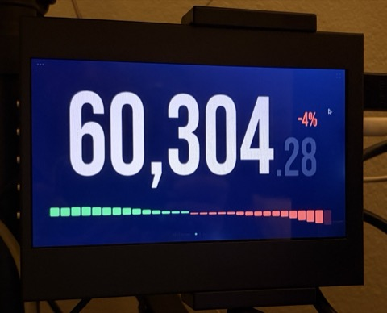
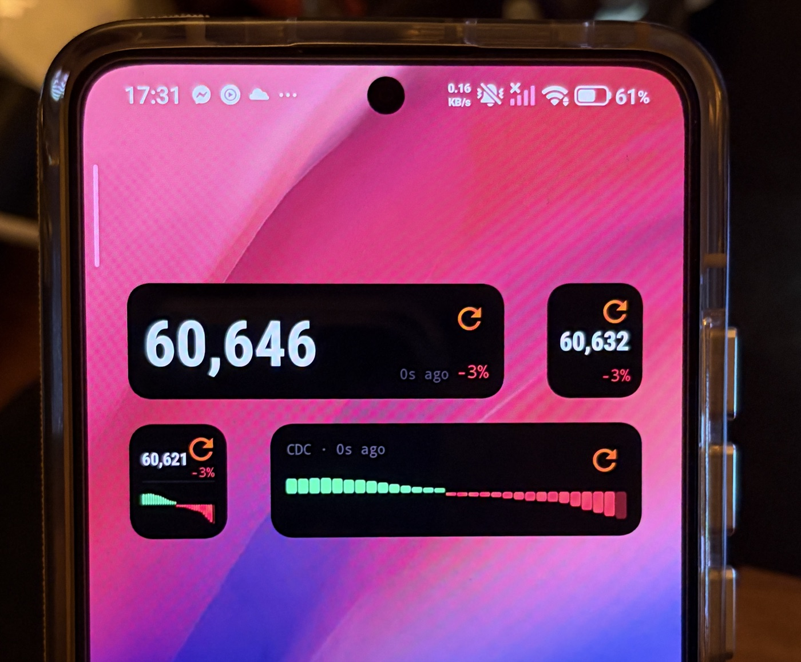

```
 ██████╗██████╗ ███╗   ██╗    ████████╗██╗ ██████╗██╗  ██╗███████╗██████╗
██╔════╝██╔══██╗████╗  ██║    ╚══██╔══╝██║██╔════╝██║ ██╔╝██╔════╝██╔══██╗
██║     ██████╔╝██╔██╗ ██║       ██║   ██║██║     █████╔╝ █████╗  ██████╔╝
██║     ██╔══██╗██║╚██╗██║       ██║   ██║██║     ██╔═██╗ ██╔══╝  ██╔══██╗
╚██████╗██║  ██║██║ ╚████║       ██║   ██║╚██████╗██║  ██╗███████╗██║  ██║
 ╚═════╝╚═╝  ╚═╝╚═╝  ╚═══╝       ╚═╝   ╚═╝ ╚═════╝╚═╝  ╚═╝╚══════╝╚═╝  ╚═╝
```

*Real-time BTC price ticker — static web app + Android APK, no server, no dependencies.*



*Works as a dedicated Bitcoin dashboard or always-on Bitcoin clock — mount any screen, open the browser, done.*

---

## Live

[**crnds.github.io/btcticker**](https://crnds.github.io/btcticker) — open in any browser, no install required.

---

## Android

[**Download the latest APK**](https://github.com/crnds/btcticker/releases/latest) — sideload on any Android device (API 24+).

Enable **Install unknown apps** in Android Settings, then open the APK to install.

> Upgrading from v1.9.0 or earlier? Those builds were debug-signed; v1.10.0 is the first release-signed build, so Android requires a one-time **uninstall → reinstall** (widgets need re-adding). Future updates install in place.



*Four widgets on a single home screen: the wide BTC Large (top-left) shows the full price with last-fetch time and % change; the compact BTC Small (top-right) gives a square glanceable price; the Combined Small (bottom-left) combines price and a mini CDC strip in one cell; and the CDC Large (bottom-right) shows the full 30-day EMA crossover chart. All update independently and share a background cache.*

---

## How It Works

```
Exchange WebSocket ──► app.js (browser) ──► requestAnimationFrame ──► DOM
 live trade stream       parses price +        batches writes at
 ~100ms updates          24hr % change         1/s max
```

The browser connects directly to the selected exchange's public WebSocket stream. Price snapshots are saved to `localStorage` every 5 minutes and pruned to a rolling 24 hr window — the last known price renders instantly on load before the socket connects.

The CDC Action Zone strip reads 30 days of daily OHLC data and renders a colour-coded EMA(12)/EMA(26) crossover bar chart at the bottom of the screen.

**Kiosk hygiene, tuned for weak hardware.** This app is built to run unattended for weeks on low-power kiosk boxes, so a few things are deliberately conservative: `#price` updates in place (persistent DOM nodes, only the sub-value that changed is touched) rather than being rebuilt from an HTML string on every tick, since it's close to the largest painted area on the whole screen; the render/localStorage cadences above favor fewer writes and repaints over sub-second precision; and the page reloads itself once a day at 4am local time to reset the JS heap and any browser-level memory fragmentation, regardless of how leak-free the app itself is.

---

## Exchanges

Switch via the `···` menu. Selection is persisted to `localStorage`.

| Exchange | Feed | Pair |
|---|---|---|
| Binance | WebSocket | BTC/USDT |
| Bitstamp | WebSocket | BTC/USD |
| Coinbase | WebSocket | BTC/USD |
| Kraken | WebSocket v2 | BTC/USD |
| OKX | WebSocket | BTC/USDT |

Bitstamp's trade stream doesn't include a 24h change figure, and their REST ticker endpoint now sits behind bot-protection that blocks plain fetches — so its % change is instead derived from the app's own rolling price history rather than fetched live.

The same `···` menu has a **Display** section below the exchange list, letting you show/hide each metric independently — TX Fees, F&G Index, 24H % Change, CDC Strip. All four are visible by default; toggling doesn't close the menu, so you can flip several at once. Below that, a separate **Night Mode** section holds two more toggles — see [Clock & Night Mode](#clock--night-mode). All six choices are persisted to `localStorage` and restored on the next visit.

On a short viewport, TX Fees and/or the CDC strip may fold away automatically to keep the price legible (see [Responsive folding](#responsive-folding)) — when that happens, their menu checkboxes go disabled with a tooltip rather than silently doing nothing.

---

## Display

```
┌────────────────────────────────────────────────────────────────┐
│ ···   NO ┆ LOW  MED  HIGH        ( F&G 38 )  ( 24H +6% )   ⛶   │
│      0.4 ┆ 0.6  0.8   1                                        │
│                                                                │
│                      104,888.50                                │
│                                                                │
│  ▄▄ ▂▂ ██ ▃▃ ▅▅ ██ ▄▄ ▂▂ ▇▇ ▅▅ ▃▃ ██ ▆▆ ▂▂ ▄▄ ▇▇ ██ ▃▃ ▅▅ ▄▄  │
│  21:37                                    WS-Status: ● live    │
└────────────────────────────────────────────────────────────────┘
   └─ Bangkok clock                            └─ connection state
```

**Top bar** — a single in-flow row, so nothing can overlap regardless of screen size:

- **Left:** the `···` settings button, then the fee bar — four sat/vB tiers from mempool.space (`NO` split off by a divider from the `LOW`/`MED`/`HIGH` group), each tier a dim uppercase label above a bold orange value
- **Right:** the **F&G** and **24H** pills, then the `⛶` fullscreen button. Each pill carries its own monospace label; F&G is coloured by quintile band (red → orange → yellow → light green → green), 24H is green `+` / red `−`. A Fear & Greed reading older than 48 hours renders dimmed with a dotted underline — a visible signal the refresh pipeline needs attention

**Price** — the dominant element, sized off its own grid row rather than the whole viewport, so it fills whatever space the top bar and footer leave rather than overflowing them. The size is **derived from the digit count**, not from a fixed fraction of the row: `min(calc(100cqw / var(--price-em)), 120cqh)`, where `--price-em` is the string's width in em, computed from the `--price-chars` that `app.js` publishes on each render. Because JetBrains Mono is fixed-advance, counting characters *is* measuring the string, so the price spans the full row at any length from `9,999` to `9,999,999.99` with no measurement pass and no way to clip. The `cqh` term is only a guard for tall-and-narrow windows — in landscape the width term binds, which is the point of the formula. Decimals sit inline at 38% of the integer size, at 50% white.

> The previous formula was `min(34cqw, 66cqh)`, which the height term always won in landscape (370px against the 586px the width offered), so the price was capped by leftover vertical space, ignored screen width entirely, and sat in ~45% of empty gutter. Don't reintroduce a fixed `cqw` term: it can't be both gap-free at six digits and clip-free at nine.

**CDC strip** — 30 daily EMA(12)/EMA(26) blocks on a centre line: bull bars grow up in green, bear bars hang down in red, bar height scaled by |EMA12 − EMA26| across the 30-day window, today's block at 40% opacity.

**Footer** — Bangkok wall clock on the left (see [Clock & Night Mode](#clock--night-mode)), connection state on the right (static green dot when live, red while reconnecting).

### Responsive folding

The layout is container-query driven, so on a short or narrow screen it degrades by dropping the least important thing first, rather than by overflowing:

| Container size | What changes |
|---|---|
| width ≤ 700px | F&G / 24H pills step down a size so the fee bar keeps its digits |
| width ≤ 400px | pills step down again |
| height ≤ 200px | CDC strip folds away |
| height ≤ 160px | fee bar labels drop, the numbers stay |
| height ≤ 120px | the whole fee bar folds away — price + pills + footer is the floor |

- Exponential backoff reconnect: 1s → 2s → 4s … capped at 16s
- `F` key or the `⛶` button toggles fullscreen; `Esc` closes the menu

---

## Clock & Night Mode

A wall clock sits in the bottom-left, **pinned to Asia/Bangkok** regardless of the kiosk machine's own timezone or locale — a kiosk box with an unconfigured system clock still shows the right time. It ticks once a minute (aligned to the minute boundary, not a 1Hz interval) and also drives the Night Mode schedule below, since both need the same "what hour is it in Bangkok" answer.

**Night Mode** collapses the entire page to a dim red-only rendering via an SVG `feColorMatrix` filter — the green and blue channels are zeroed outright rather than desaturated, matching red-light night-vision practice so a wall-mounted display doesn't light up a dark room. Two independent toggles in the `···` menu's **Night Mode** section:

| Toggle | Behaviour |
|---|---|
| **Schedule 23:00–08:00** | Night Mode turns itself on and off on that Bangkok-time window (wrapping past midnight). Off by default. |
| **Force Night Mode** | Holds Night Mode on regardless of the hour. Off by default. Wins over the schedule. |

---

## Android Widgets

Seven home screen widgets across three sizes. All show a live preview thumbnail in the widget picker, have an orange refresh button, and automatically reschedule their alarms after device reboot.

| Widget | Size | Refresh | Data source |
|---|---|---|---|
| BTC Large | 2×1 | 10 min | Binance REST |
| CDC Large | 2×1 | Daily | Kraken OHLC |
| BTC Small | 1×1 | 10 min | Binance REST |
| CDC Small | 1×1 | Daily | Kraken OHLC |
| Combined Large | 2×1 | 10 min (CDC lazy) | Binance + Kraken |
| Combined Small | 1×1 | 10 min (CDC lazy) | Binance + Kraken |
| Fear & Greed | 2×1 | Daily | CoinMarketCap |

### BTC Large (2×1)

```
┌──────────────────────────────────┐
│ 104,888                        ↻ │
│  at 23:24 (5m ago)          +6% │
└──────────────────────────────────┘
```

Price autoscales to fill the full widget height. % change and last-fetch time (absolute 24hr clock + relative age) overlaid at bottom-right.

### CDC Large (2×1)

```
┌──────────────────────────────────┐
│ CDC · at 23:24 (3h ago)        ↻ │
│ ▄▄▂▂██▃▃▅▅██▄▄▂▂▇▇▄▄▂▂██       │
└──────────────────────────────────┘
```

30-day EMA(12)/EMA(26) crossover strip. Green bars = bull, red bars = bear, today's bar at 40% opacity. Refreshes once daily; falls back to cached data when offline.

### BTC Small (1×1)

```
┌──────────────┐
│           ↻  │
│  104,888     │
│         +6%  │
└──────────────┘
```

Compact single-cell price widget. Same autoscaled price, % change overlaid bottom-right.

### CDC Small (1×1)

```
┌──────────────┐
│ CDC       ↻  │
│ ▄▂█▃▅█▄▂▇▄  │
│ ▅█▄▂▄█▅▂██  │
└──────────────┘
```

CDC strip squeezed into a single cell — 30 bars with no gaps to fit the full history.

### Combined Large (2×1)

```
┌─────────────────┬───────────────────────┐
│                 │ CDC · at 23:24 (3h ago)│
│    104,888      │ ▄▂█▃▅█▄▂▇▄          ↻ │
│           +6%   │ ▅█▄▂▄█▅▂██            │
└─────────────────┴───────────────────────┘
```

Combined widget — price on the left half, CDC strip on the right half, 50/50 split. Price refreshes every 10 minutes; CDC re-fetches only when the cache is older than 12 hours.

### Combined Small (1×1)

```
┌──────────────┐
│  104,888  ↻  │
│         +6%  │
├──────────────┤
│ ▄▂█▃▅█▄▂▇▄  │
└──────────────┘
```

Compact single-cell combined widget — price with % change in the top half, CDC strip in the bottom half, 50/50 vertical split. Price refreshes every 10 minutes; CDC re-fetches only when the cache is older than 12 hours.

### Fear & Greed (2×1)

```
┌──────────────────────────────────┐
│ Fear & Greed                   ↻ │
│      ●                           │
│   ██ ██ ██ ██ ██                 │
│        15                        │
│    Extreme fear                  │
└──────────────────────────────────┘
```

Semicircular gauge with 5 colour-coded arc segments (red → orange → yellow → light green → green). A white dot marks the current value position on the arc. Fetches the [alternative.me Fear & Greed Index](https://alternative.me/crypto/fear-and-greed-index/) (keyless API) once daily; falls back to cached value when offline.

The value number is coloured by the same quintile bands as the arc:

| Range | Colour |
|---|---|
| 0–19 | `#ff1744` red |
| 20–39 | `#ff6d00` orange |
| 40–59 | `#ffeb3b` yellow |
| 60–79 | `#69f0ae` light green |
| 80–100 | `#00e676` bright green |

---

## CDC Data

Two-tier fallback so the strip always renders:

1. **`localStorage`** — cached for 1 hour after last read
2. **`data/cdc.js`** — bundled snapshot committed to the repo by CI, refreshed daily

There's no live client-side fetch to Kraken — `data/cdc.js` is always bundled with the app, so a browser-side fallback would never actually run. Refreshing the data means updating the committed file, which happens automatically:

```bash
python3 fetch_cdc.py
```

This only rewrites `data/cdc.js` when the blocks themselves changed, or the on-disk timestamp is more than ~20 hours old — pass `--force` to write unconditionally. See [Data Refresh Pipeline](#data-refresh-pipeline) below.

---

## Transaction Fees

Four priority tiers (No / Low / Med / High) shown above the price, sourced from mempool.space's [`/api/v1/fees/mempool-blocks`](https://mempool.space/docs/api/rest#get-mempool-blocks-fees) — each projected block holds ~10 min of pending transactions, and the median fee at a given block depth becomes that tier:

| Tier | Depth | ETA |
|---|---|---|
| High | 1st projected block | ~10 min |
| Med | 3rd projected block | ~30 min |
| Low | 6th projected block | ~1 hr |
| No | cheapest projected block | economy |

This gives genuinely fractional sat/vB values, unlike the whole-number `/fees/recommended` endpoint. Polled every 60s and cached in `localStorage` (shared with the dashboard) so the bar repaints instantly on load.

**Display rounding** happens client-side only — values ≥1 sat/vB round to a whole number, values below 1 round to 1 decimal (e.g. `0.27` → `0.3`). The fetched and cached values themselves always stay fractional-precise; only the on-screen text is rounded.

---

## Fear & Greed Index (Ticker)

Shown as a labelled pill in the top-right of the top bar (see [Display](#display)), coloured by quintile band (red → orange → yellow → light green → green). Unlike the Android widget (which uses the keyless alternative.me API), the ticker's reading comes from **CoinMarketCap**, which requires a private API key — so it's never fetched from the browser. Instead, a GitHub Actions workflow (`update-fng.yml`) fetches it server-side every 6 hours and commits the result to `data/fng.js`:

1. **`localStorage`** — cached for 1 hour after last read
2. **`data/fng.js`** — bundled snapshot committed by CI, refreshed 6-hourly
3. A reading older than 48 hours is flagged **stale** in the UI (dimmed, dotted underline) — a signal the refresh pipeline (e.g. the `CMC_API_KEY` secret) needs attention

To refresh the bundled snapshot manually (requires `CMC_API_KEY`):

```bash
CMC_API_KEY=xxxxxxxx python3 fetch_fng.py
```

Like `fetch_cdc.py`, this only writes when the reading actually changed or the on-disk stamp is stale enough to need refreshing — pass `--force` to write unconditionally.

---

## Data Refresh Pipeline

`fetch_cdc.py` and `fetch_fng.py` are run on a schedule by `.github/workflows/update-cdc.yml` (daily, 00:05 UTC) and `update-fng.yml` (every 6 hours), each committing straight to `main` as `github-actions[bot]`.

Both scripts skip the write — and so skip the commit — unless the data actually changed:

- **Semantic fields only.** `fetch_cdc.py` compares the `blocks` array; `fetch_fng.py` compares `value` and `classification`. The `generated` wall-clock stamp is deliberately excluded from that comparison (every run would otherwise "change" the file) but is never dropped from the payload itself — `db.html` anchors its CDC day labels and both pages' staleness checks to it.
- **A ~20 hour heartbeat** forces a write even with no semantic change, so the on-disk stamp can't go stale enough to make a healthy pipeline look broken under the 24h/48h freshness checks described above.
- **`--force`** on either script bypasses the guard entirely.

The two workflows share a `concurrency: data-commit` group (they queue rather than cancel each other — a cancelled run would silently drop a data point) and retry a rejected `git push` by rebasing onto `origin/main`, up to 3 times, since GitHub's scheduler routinely runs these jobs hours late and the two crons are only 5 minutes apart.

Both fetch scripts retry transient network failures with exponential backoff before giving up.

---

## Testing

```bash
npm test   # python3 -m unittest discover -s tests -t . -v
```

A small stdlib-only suite (no `pytest`, no dependencies to install — both fetch scripts are stdlib-only by design, so the test runner matches):

- **`tests/test_ema.py`** — golden-vector tests for `fetch_cdc.py`'s EMA recurrence and its 30-block builder, against a frozen fixture (`tests/fixtures/ema_golden.json`) that is never regenerated from the implementation under test.
- **`tests/test_freshness.py`** — tests for the `should_write()` commit-spam guard described above.
- **`tests/test_data_files.py`** — smoke tests on the committed `data/cdc.js` / `data/fng.js` artefacts.

`.github/workflows/ci.yml` runs this suite plus a version-consistency check (`package.json` vs `package-lock.json` vs `android/app/build.gradle`) on every push and pull request.

---

## Building the Android APK

Requires [Android Studio](https://developer.android.com/studio).

```bash
# 1. Stage web assets into www/ and sync the Android project
npm run sync:android

# 2. Open in Android Studio
npx cap open android

# 3. Build → Build APK(s) → app-debug.apk
```

`npm run sync:android` stages `index.html`, `db.html`, `style.css`, `shared.js`, `app.js`, `assets/` and `data/` into the gitignored `www/` directory (Capacitor's `webDir`, per `capacitor.config.json`) and then runs `npx cap sync android`. It shares its file list with `npm run build` (below), so the Cloudflare Pages output and the Android bundle can't drift out of sync with each other — see [Deployment](#deployment).

### Release build

Release builds are signed and minified (R8). Signing material lives in
`android/keystore.properties` + `android/btcticker-release.keystore` — both
gitignored, **back them up**; losing the keystore means users must uninstall
and reinstall to upgrade.

```bash
cd android && ./gradlew assembleRelease
# → app/build/outputs/apk/release/app-release.apk
```

If `keystore.properties` is absent the release build falls back to unsigned.
To regenerate signing material:

```bash
keytool -genkeypair -keystore android/btcticker-release.keystore \
  -alias btcticker -keyalg RSA -keysize 2048 -validity 10000
# then write android/keystore.properties:
#   storeFile=btcticker-release.keystore
#   storePassword=…
#   keyAlias=btcticker
#   keyPassword=…
```

---

## Deployment

The web app has no build step of its own — `index.html`, `style.css`, `shared.js`, `app.js` and `db.html` are plain files you can open directly (see [Usage](#usage)). Three deployment targets share that source, each with its own packaging:

| Target | Command | Output | Notes |
|---|---|---|---|
| **GitHub Pages** | none — serves the repo root directly | — | what [crnds.github.io/btcticker](https://crnds.github.io/btcticker) runs |
| **Cloudflare Pages** | `npm run build` | `dist/` | build command `npm run build`, output directory `dist`, configured in the Cloudflare Pages dashboard |
| **Android APK** | `npm run sync:android` | `www/` → APK | `webDir` in `capacitor.config.json` is `www`, not `dist` — see [Building the Android APK](#building-the-android-apk) |

`npm run build` exists purely for Cloudflare Pages: Cloudflare's build step installs `node_modules` (which includes a large `workerd` binary from the Capacitor tooling) before running the build command, and copying only the web assets into `dist/` keeps that out of the deployed asset bundle. Both `dist/` and `www/` are produced by the same `build:www` step, so they can never end up with a different file list between them.

---

## File Structure

```
btcticker/
├── index.html              — ticker: top bar (menu + fee bar + F&G/24H pills + fullscreen), price, CDC strip, clock/status footer, Night Mode filter
├── style.css               — layout, JetBrains Mono font, dark theme, container-query responsive folding
├── shared.js               — logic shared by index.html and db.html: fetch-with-timeout, storage keys, F&G ramp/staleness, fee-tier derivation, CDC bar scaling (see its header comment for why it's a plain classic script)
├── app.js                  — WebSocket client, localStorage history, clock/Night Mode, CDC/fees/F&G rendering
├── db.html                 — dashboard: CDC stats + fee tiers + price history
├── fetch_cdc.py            — fetches daily OHLC from Kraken, writes data/cdc.js (only when it changed — see Data Refresh Pipeline)
├── fetch_fng.py            — fetches CoinMarketCap Fear & Greed index, writes data/fng.js (same write-guard)
├── tests/                  — stdlib unittest suite for the two fetch scripts (`npm test`)
│   ├── fixtures/ema_golden.json — frozen EMA/CDC-block golden vectors, shared with the Android test below
│   ├── test_ema.py         — calc_ema() + block-builder golden-vector tests
│   ├── test_freshness.py   — should_write() commit-spam guard tests
│   └── test_data_files.py  — smoke tests on the committed data/*.js files
├── data/
│   ├── cdc.js              — bundled CDC data (the only tier the browser actually reads)
│   └── fng.js              — bundled Fear & Greed snapshot (ditto)
├── assets/
│   ├── jetbrains-mono-800.woff2 — self-hosted UI font, price weight (17.4 KB, ASCII subset)
│   └── jetbrains-mono-400.woff2 — same face, label weight (17.4 KB, ASCII subset)
├── install.sh              — Linux kiosk installer (browser launcher + autostart)
├── .github/workflows/
│   ├── ci.yml              — runs the test suite + a version-consistency check on push/PR
│   ├── update-cdc.yml      — daily GitHub Actions refresh of data/cdc.js
│   └── update-fng.yml      — 6-hourly GitHub Actions refresh of data/fng.js
├── docs/                   — README screenshots
├── android/                — Capacitor Android project (build APK in Android Studio)
│   └── app/src/main/java/com/btcticker/app/
│       ├── BaseWidgetProvider.java        — shared alarm/refresh/fetch plumbing
│       ├── BinanceApi.java                — BTCUSDT ticker fetch + prefs cache
│       ├── KrakenCdc.java                 — CDC blocks fetch/cache + strip renderer
│       ├── Http.java                      — small HTTP response reader
│       ├── PriceWidgetProvider.java       — BTC Large widget (2×1)
│       ├── CdcWidgetProvider.java         — CDC Large widget (2×1)
│       ├── PriceWidgetSmallProvider.java  — BTC Small widget (1×1)
│       ├── CdcWidgetSmallProvider.java    — CDC Small widget (1×1)
│       ├── CombinedWidgetProvider.java    — Combined Large widget (2×1)
│       ├── MiniCombinedWidgetProvider.java — Combined Small widget (1×1)
│       ├── FearGreedWidgetProvider.java   — Fear & Greed widget (2×1)
│       └── BootReceiver.java              — reschedules alarms after reboot
├── capacitor.config.json   — Capacitor config (webDir: www)
├── package.json            — build/test scripts + Capacitor dependencies
├── package-lock.json
└── CTD.MD                  — design notes for a possible ESP32/CYD firmware port
```

---

## Usage

Open `index.html` directly in a browser. No build step or server required.

```bash
open index.html         # macOS
xdg-open index.html     # Linux
```

For kiosk / fullscreen display:

```bash
# Chromium
chromium-browser --kiosk --incognito index.html

# Firefox
firefox --kiosk index.html
```

---

## Local Storage Keys

| Key | Contents |
|---|---|
| `btcticker_v1_history` | Price snapshots (rolling 24 hr) |
| `btcticker_v1_exchange` | Last selected exchange |
| `btcticker_v1_cdc` | CDC blocks cache (1 hr TTL) |
| `btcticker_v1_fng` | Fear & Greed index cache (1 hr TTL) |
| `btcticker_v2_fees` | Mempool fee tiers cache (60s TTL) — shared with the dashboard |
| `btcticker_v1_visibility` | Per-metric show/hide preference: `fees`, `fng`, `change`, `cdc`, `nightSchedule`, `nightForce` (six keys) |

Pre-v1 unversioned keys (`btcticker_history`, `btcticker_exchange`) are migrated automatically on first load. `shared.js` (`window.BTC.keys`) is the single source of truth for every key name above — both `app.js` and `db.html` read them by reference rather than re-typing the strings.

---

## Font

**JetBrains Mono**, self-hosted at two weights — `assets/jetbrains-mono-800.woff2` (the price and the pill values) and `assets/jetbrains-mono-400.woff2` (every label). No external font requests on load; both are preloaded ahead of `style.css`, the 800 first since it's the text that has to paint.

Both files are subset to printable ASCII plus `…` and `—` (17.4 KB each, 35.0 KB total, against 13.7 KB for the single Bebas Neue file this replaced). `font-display: block` on both is deliberate — see `OPUS-PLAN.md`.

A side benefit of the fallback chain being `ui-monospace, monospace`: SF Mono, Menlo and Roboto Mono all use the same 0.60 em advance, so if the woff2 never arrives the price still fits the row exactly rather than clipping. Under Bebas the fallback rendered 40–50% wider.

One family covers the whole UI. The small labels (`#fees`, `#clock`, `#ws-status`, `.badge::before`, the menu, `#loading`) previously asked for generic `monospace`, which resolves to SF Mono on macOS and Roboto Mono in the car's WebView — so the kiosk never quite matched what development looked like. `db.html` is deliberately *not* included; it remains its own `system-ui` design system.

Two things are coupled to the choice of face and must move together: `--adv` in `.price-figure` (the digit advance, 0.60 em) and the `cqw` growth terms on `.badge`. A face with a different advance silently mis-fits the price; a wider one squeezes the fee bar, since `.topbar-right` doesn't shrink.

---

## Data Sources & Credits

BTC Ticker has no backend of its own — every number on screen is fetched straight from a public API. Thanks to these providers for making free market data available:

| Provider | Used for |
|---|---|
| [Binance](https://www.binance.com) | Live price stream (default exchange) and the Android widgets' REST ticker |
| [Bitstamp](https://www.bitstamp.net) | Live price stream (24h change is derived locally, not fetched) |
| [Coinbase](https://www.coinbase.com) | Live price stream (Advanced Trade WebSocket) |
| [Kraken](https://www.kraken.com) | Live price stream + daily OHLC candles powering the CDC Action Zone |
| [OKX](https://www.okx.com) | Live price stream |
| [mempool.space](https://mempool.space) | Transaction fee tiers, via their [mempool-blocks endpoint](https://mempool.space/docs/api/rest#get-mempool-blocks-fees) |
| [CoinMarketCap](https://coinmarketcap.com) | Fear & Greed Index for the ticker (fetched server-side only, via a private API key) |
| [Alternative.me](https://alternative.me/crypto/fear-and-greed-index/) | Fear & Greed Index for the Android widget (keyless, public endpoint) |

None of these providers endorse or are affiliated with this project — they're credited here simply because this app couldn't exist without their free, public data. In return, BTC Ticker tries to be a good citizen of each API: requests are read-only, cached in `localStorage` before ever hitting the network again, polled on the slowest cadence that still feels live (60s–24h depending on the source), and WebSocket reconnects back off exponentially instead of hammering a dead connection.

---

## Changelog

### v1.12.0
- **Layout**: the fee bar moved from centre-top to the top-left (beside the `···` menu button); the F&G and 24H badges moved from below the price to the top-right (beside the fullscreen button) — both now live in a single in-flow `#topbar` row instead of absolutely-positioned overlays, so nothing can collide. CDC strip and the F&G/24H badges enlarged.
- **Correctness**: `[hidden]` now actually hides the F&G/24H badges (an author `display` rule was silently overriding the browser default, leaving an empty pill on screen); fixed a WebSocket exchange-switch race where a stale `await` continuation could write the previous exchange's 24h change onto the new one; a corrupt/malformed `localStorage` history entry can no longer strand the kiosk at boot; settings-menu toggles for TX Fees/CDC Strip now go disabled (with a tooltip) instead of silently doing nothing when a short viewport has folded them away via container query.
- **Performance**: the CDC strip repaints via a `ResizeObserver` instead of polling `clientHeight` on a debounced window resize (fixes a bug where a height change with no window resize — e.g. a container-query fold — could bake in 1px-tall bars); repeated CDC re-renders with identical data are now skipped via a signature check; the clock ticks once a minute, minute-aligned, instead of every second; fee/CDC network activity pauses while the tab is hidden and catches up on return; the display font is preloaded and all scripts load with `defer`.
- **Refactor**: extracted `shared.js` — fetch-with-timeout, storage keys, the Fear & Greed colour ramp, mempool fee-tier derivation, and CDC bar-height scaling, all previously duplicated between `app.js` and `db.html` (in one case with three separate copies of the same colour ramp). Removes ~115 duplicated lines and closes a drift risk between the ticker's and dashboard's CDC-strip renderers. Also deleted the dead Kraken CDC REST fallback and its `calcEMA()` in `app.js` — unreachable, since `data/cdc.js` is always bundled and always satisfies the tier ahead of it.
- **CI/data pipeline**: `fetch_cdc.py`/`fetch_fng.py` now only commit when the underlying reading actually changed, or a ~20h heartbeat requires a refresh — previously every scheduled run committed regardless, even when nothing had changed. Added retry-with-backoff to both fetches. The two GitHub Actions workflows now share a `concurrency` group and retry a rejected push by rebasing, since their schedules are 5 minutes apart and GitHub's scheduler routinely runs them hours late.
- **Tests**: added a stdlib-only `unittest` suite — EMA golden-vector tests (`fetch_cdc.calc_ema`), tests for the new commit-spam guard, and smoke tests on the committed `data/*.js` files — plus a CI workflow that runs it and checks `package.json`/`package-lock.json`/`build.gradle` version numbers agree.

### v1.11.1
*(Tagged as a patch; in substance a minor release — 21 commits.)*
- Added mempool.space transaction fee tiers (No/Low/Med/High) to both the ticker and the dashboard, with fluid `min(vw, vh)`-scaled sizing and fractional display rounding.
- Added per-metric show/hide toggles to the settings menu (TX Fees, F&G Index, 24H % Change, CDC Strip).
- Added a Bangkok-time wall clock and Night Mode (23:00–08:00 schedule toggle + a force-on toggle), rendered via an SVG `feColorMatrix` red filter.
- Reworked the layout onto CSS grid + container queries to fix collisions on small windows; retuned the price sizing formula.
- Moved the WS-Status indicator to the bottom-right and made it a static (non-animated) dot to cut rendering cost; switched fixed UI chrome to absolute positioning to reduce GPU compositor layers on low-power kiosk hardware.
- Fixed Bitstamp's 24h change to derive from local price history instead of a REST endpoint that started returning bot-protection challenge pages.
- Fixed an Android widget boot-lifecycle issue and a divide-by-zero in the widget code.
- Added the Cloudflare Pages build script (`npm run build`) to isolate the deployed web assets from `node_modules`.

### v1.11.0 — dashboard redesign & 6-hourly Fear & Greed
- Fear & Greed Index sourced from CoinMarketCap via a server-side-fetched, committed data file (`fetch_fng.py`, `update-fng.yml`) — shown above the 24h change in the ticker and as its own section on the dashboard.
- Refresh cadence moved from daily to every 6 hours, to track CMC's intraday index movement.
- A Fear & Greed reading older than 48 hours is now flagged **stale** in the UI (dimmed, dotted underline) instead of being served silently.
- Dashboard redesign: compact 1280×720 layout with a live Binance price poll in the header.
- Fixed the settings menu wrapping the dashboard link onto its own line after the button/anchor menu refactor.

### v1.10.0
- **Security**: removed the hardcoded CoinMarketCap API key — Fear & Greed widget now uses the keyless [alternative.me](https://alternative.me/crypto/fear-and-greed-index/) API; widget receivers are no longer exported (third-party apps can't trigger refresh fetches); release builds are now signed and R8-minified (`android/keystore.properties`, gitignored); `allowBackup` disabled.
- **Android refactor**: extracted `BaseWidgetProvider` + `BinanceApi`/`KrakenCdc`/`Http` helpers — 1,933 → ~950 lines across the widget code. Refresh broadcasts now use `goAsync()` so updates aren't killed mid-fetch; all network failures are logged (`btcticker.widget` tag); connections closed via try-with-resources.
- **Fetch dedupe**: widget families sharing a data source reuse a fetch made within the last 60 s — multiple widgets (or a boot restart) trigger one Binance/Kraken call instead of four; manual tap always forces a fresh fetch.
- Failed CDC fetch with no cache now shows "CDC · failed" instead of being stuck on "fetching…"; manual refresh no longer wipes the displayed price; small widgets expose data age via accessibility content description; Fear & Greed value colour now uses the same quintile bands as the arc (Neutral 50 is yellow, not green).
- **Ticker fixes**: WebSocket backoff actually backs off now (was resetting to 1 s on every retry); pending reconnect timers cleared on exchange switch; price history is no longer fabricated while the socket is down; cached prices show their real age on load; CDC strip shows an error state when all data tiers fail.
- **Conventions**: single `STATE` object, CSS custom-property tokens in `style.css`, `prefers-reduced-motion` support, visible focus rings, keyboard-accessible exchange menu (real buttons + ARIA), localStorage keys versioned to `btcticker_v1_*` with automatic migration.
- **Pipeline**: `fetch_cdc.py` validates the Kraken response (error field, ≥56 candles) and writes atomically; GitHub Actions pinned to commit SHAs; `install.sh` is idempotent and runs `apt-get update` first.

### v1.9.0
- **Widget picker previews**: All 7 widgets now show high-quality, representative preview thumbnails in the Android widget selection screen (long-press home → Widgets).
- Removed the generic app launcher icon as `previewImage` fallback across all widget providers — was displaying the wrong icon on many devices and launchers.
- Significantly improved the Fear & Greed preview layout to include the 5 colour-coded arc segments, position indicator dot, value, classification label, and timestamp — now visually matches the actual rendered gauge.
- Widgets no longer appear blank or empty on first placement from the picker: added immediate skeleton states (`—` for prices, `CDC · –` for strips, etc.) in `onUpdate` before network fetches complete.
- Added missing default `—` placeholder to the Combined Large (2×1) price pane.
- Fixed incorrect "1×1" comment for the Fear & Greed widget in `AndroidManifest.xml`.
- Added `android/.idea/` to `.gitignore` (prevented IDE files from leaking into the repo).
- Minor preview layout polish (refresh button sizes, padding, and positioning for better visual parity with runtime widgets).

### v1.8.0
- Added Fear & Greed widget (2×1) — semicircular gauge with 5 colour-coded segments, white dot indicator, and value/label rendered as a Canvas bitmap; fetches CoinMarketCap Fear & Greed Index once daily

### v1.7.0
- Renamed all six widget picker labels: BTC Large, BTC Small, CDC Large, CDC Small, Combined Large, Combined Small
- Fixed 2×1 widget grid size: `minWidth` corrected from 180dp to 110dp — was occupying 3 columns instead of 2 on POCO and Samsung launchers
- Last-fetch time now shows absolute 24hr clock + relative age: `at 23:24 (5m ago)`
- Last-fetch time colour changed to white (#ffffff) across all widgets
- Fixed missing initial label text on CDC Small widget (showed blank until first alarm)
- Added missing `minResizeWidth`/`minResizeHeight` to Combined Small widget info

### v1.6.0
- Added 1×1 BTC Mini widget — price in the top half, CDC strip in the bottom half, 50/50 vertical split

### v1.5.0
- Refresh button restored to original orange (#F4620E) and original sizes (24dp / 28dp / 20dp / 24dp) across all widgets

### v1.4.0
- Audit fixes: added `textSize` fallback on price widgets for API 24–25 compatibility; added `—` placeholder on 1×1 price widget initial state
- BootReceiver refactored — each of the 5 providers restarts independently with isolated error handling
- Combined widget (BTC + CDC) crash fix: replaced unsupported `<View>` divider with `<TextView>` for RemoteViews compatibility

### v1.3.0
- Added 1×1 BTC Price widget
- Added 1×1 CDC widget
- Added 2×1 BTC + CDC combined widget
- All 5 widgets have live preview thumbnails in the widget picker

### v1.2.0
- Widget picker thumbnails (previewLayout) for BTC Ticker and CDC Strip
- Renamed widget picker labels to "BTC Ticker" and "CDC Strip"

### v1.1.0
- BTC Ticker home screen widget (2×1) — Binance price, 10-min auto-refresh
- CDC Strip home screen widget (2×1) — Kraken OHLC, daily auto-refresh
- BootReceiver to reschedule alarms after device reboot
